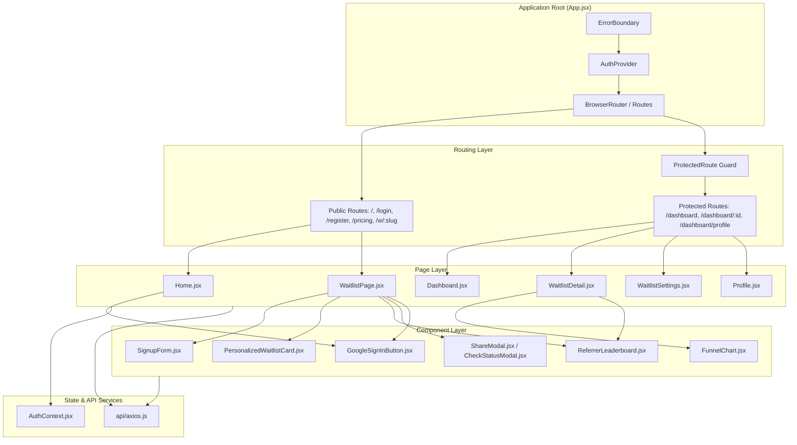

# LaunchQueue — Frontend

[](https://github.com/codeWith-Ashwani/launchqueue/actions/workflows/ci.yml)
[](https://react.dev)
[](LICENSE)

LaunchQueue is a full-stack SaaS platform designed for early-stage founders to run viral pre-launch waitlists. When visitors join a waitlist, they receive a live queue position and a unique referral link. Sharing that link moves them forward in line and unlocks tiered milestone rewards.

This repository contains the client-side single-page application (SPA) built with React 19, Vite, and React Router 7.

---

## Table of Contents
- [Overview](#overview)
- [Key Features](#key-features)
- [Tech Stack](#tech-stack)
- [Frontend Architecture](#frontend-architecture)
- [Project Structure](#project-structure)
- [Design System](#design-system)
- [State Management & Data Flow](#state-management--data-flow)
- [Security & Session Handling](#security--session-handling)
- [Testing](#testing)
- [Environment Configuration](#environment-configuration)
- [Local Development](#local-development)
- [Known Limitations](#known-limitations)

---

## Overview

The frontend serves two primary user roles:
1. **Founders**: Manage campaigns, customize branding and rewards in a real-time side-by-side preview studio, analyze traffic and referral conversion funnels, manually override subscriber positions, batch invite subscribers, and export leads to CSV.
2. **End-User Subscribers**: View public waitlists (`/w/:slug`), sign up with referral tracking, look up their position, view milestone unlock progress, copy custom referral links, and view public community leaderboards.

---

## Key Features

### Authentication & Account Security
- **Email & Password Authentication**: Dedicated Login and Registration forms with client-side validation and sanitized error handling.
- **Google OAuth 2.0 Sign-In**: Integrated Google Identity Services (GSI) via `<GoogleSignInButton />` for one-click login and registration.
- **Password Reset Flow**: Two-step flow via `/forgot-password` (request reset link) and `/reset-password` (single-use token entry with password confirmation).
- **Session Persistence**: Automated background session verification on app load via `GET /api/auth/me` with cookie-backed credentials.

### Founder Dashboard & Campaign Management
- **Campaign Overview (`/dashboard`)**: List of all waitlists owned by the founder with quick stats (signups, status, creation date).
- **Waitlist Creation Wizard (`/dashboard/new`)**: Step-by-step creation specifying name, slug, and initial messaging. Plan-level limits (Free: 1, Starter: 3, Pro/Agency: Unlimited) are respected.
- **Live Settings Studio (`/dashboard/:id/settings`)**: Responsive two-column configuration studio where changes to hero copy, accent colors, feature lists, milestone rewards, and thank-you notes render synchronously in an embedded live preview.

### Analytics & Conversion Funnel
- **KPI Metrics Cards**: Real-time display of total visitors, total signups, overall conversion rate, signups today, and referral rate.
- **Signup Trajectory Chart**: 30-day historical time-series line chart rendered using Recharts.
- **Conversion Funnel Visualization**: Stage-by-stage bar chart analyzing `Page Views → Total Signups → Direct Signups → Referred Signups` with zero-division protection.
- **CSV Data Export**: One-click download of all subscribers (email, position, referral count, join date) formatted per RFC 4180 (gated to paid subscription tiers).

### Admin Controls & Access Management
- **Subscriber Roster**: Complete table of all subscribers sorted by queue rank.
- **Inline Position Override**: Direct inline input allowing founders to manually bump or adjust a subscriber's queue position without triggering algorithm recalculations.
- **Batch Invite System**: Multi-select row selection with "Select All" toggle and a confirmation prompt to trigger batch invite notifications and status updates.
- **Visual Status Badges**: Distinguishes between `waiting` and `invited` subscriber states.

### Public Waitlist Experience (`/w/:slug`)
- **Branded Campaign Display**: Dynamically renders the founder's custom headline, subheadline, hero image, accent color theme, and feature grid.
- **Referral-Aware Signup**: Automatically captures and persists `?ref=CODE` query parameters from the URL into `sessionStorage` and `localStorage`.
- **Personalized Queue Card**: Upon joining, displays the subscriber's exact rank (e.g., `#42`), dynamic referral count, progress bar, milestone unlock checklist, and one-click social sharing buttons (Twitter/X, WhatsApp, LinkedIn, and clipboard copy).
- **Rank Lookup Modal (`CheckStatusModal`)**: Allows returning subscribers to look up their current rank and referral progress by submitting their email or referral code.
- **Community Leaderboard (`ReferrerLeaderboard`)**: Displays the Top 10 referrers with masked email addresses (e.g., `a***e@gmail.com`) for privacy.
- **Live Activity Feed (`LiveActivityFeed`)**: Periodically polled ticker showing recent signups with relative timestamps.

### Founder Profile & Subscription Management
- **Founder Profile (`/dashboard/profile`)**: Update name and email address, change password, and view current subscription plan tier.
- **Pricing & Checkout (`/pricing`)**: Tier comparison (Free, Starter, Pro, Agency) integrated with Lemon Squeezy hosted checkout sessions.
- **Customer Billing Portal**: Direct link for subscribed founders to manage invoices, payment methods, and plan cancellations.

---

## Tech Stack

| Category | Technology | Purpose |
| :--- | :--- | :--- |
| **Core Framework** | React 19 | UI component architecture and hooks (`useState`, `useEffect`, `useCallback`, `useMemo`) |
| **Build Tool & Bundler** | Vite 8 | Development server with Hot Module Replacement (HMR) and optimized rollup production builds |
| **Routing** | React Router 7 | Client-side declarative routing and protected route wrappers |
| **HTTP Client** | Axios 1.x | Configured API client with `withCredentials: true` for cookie exchange |
| **Data Visualization** | Recharts 2.x | SVG-based responsive line and bar charts |
| **Authentication** | Google Identity Services (GSI) | Google Sign-In SDK integration |
| **Visual Effects** | Canvas Confetti | Celebration confetti on waitlist signup and milestone completion |
| **Icons** | Lucide React | Clean icon primitives for UI actions |
| **Testing** | Vitest & React Testing Library | Unit and component integration testing in jsdom environment |
| **Styling** | Custom Pure CSS Tokens | Monochrome SaaS design system in `src/index.css` |

---

## Frontend Architecture

The frontend follows a layered component architecture with centralized routing, global authentication context, dedicated API abstraction, and custom hooks.



---

## Project Structure

```text
client/
├── public/
│   └── favicon.svg                  # Brand favicon asset
├── src/
│   ├── api/
│   │   └── axios.js                 # Axios instance (baseURL, credentials: true)
│   ├── components/
│   │   ├── __tests__/               # Component unit tests
│   │   │   ├── ErrorBoundary.test.jsx
│   │   │   ├── GoogleSignInButton.test.jsx
│   │   │   └── SignupForm.test.jsx
│   │   ├── CheckStatusModal.jsx     # Rank & referral lookup dialog
│   │   ├── ErrorBoundary.jsx        # Top-level React error boundary
│   │   ├── FunnelChart.jsx          # Recharts conversion funnel visualization
│   │   ├── GoogleSignInButton.jsx   # Google GSI sign-in button
│   │   ├── HomeButton.jsx           # Global navigation component
│   │   ├── LiveActivityFeed.jsx     # Polled real-time signup ticker
│   │   ├── PersonalizedWaitlistCard.jsx # Queue position & referral stats
│   │   ├── ProtectedRoute.jsx       # Route guard redirecting unauthenticated users
│   │   ├── ReferralRewardCard.jsx   # Reward milestone progress card
│   │   ├── ReferrerLeaderboard.jsx  # Top referrers leaderboard
│   │   ├── ShareModal.jsx           # Social sharing and link copy dialog
│   │   ├── SignupForm.jsx           # Public waitlist join input
│   │   ├── SignupsChart.jsx         # 30-day signup growth line chart
│   │   └── StatCard.jsx             # Key metric card
│   ├── context/
│   │   └── AuthContext.jsx          # Session state, login, register, logout
│   ├── hooks/
│   │   ├── useAuth.js               # AuthContext hook
│   │   └── useWaitlist.js           # Waitlist data fetching hook
│   ├── pages/
│   │   ├── __tests__/               # Page integration tests
│   │   │   ├── ForgotPassword.test.jsx
│   │   │   ├── Login.test.jsx
│   │   │   ├── Pricing.test.jsx
│   │   │   ├── Profile.test.jsx
│   │   │   ├── ResetPassword.test.jsx
│   │   │   └── WaitlistDetail.test.jsx
│   │   ├── CreateWaitlist.jsx       # Campaign creation form
│   │   ├── Dashboard.jsx            # Founder campaign list
│   │   ├── ForgotPassword.jsx       # Password reset request page
│   │   ├── Home.jsx                 # Public marketing landing page
│   │   ├── Login.jsx                # Founder login page
│   │   ├── Pricing.jsx              # Subscription plan comparison
│   │   ├── Profile.jsx              # Founder profile & password settings
│   │   ├── Register.jsx             # Founder registration page
│   │   ├── ResetPassword.jsx        # Password reset confirmation page
│   │   ├── WaitlistDetail.jsx       # Detailed analytics, admin controls, export
│   │   ├── WaitlistPage.jsx         # Public campaign page (/w/:slug)
│   │   ├── WaitlistSettings.jsx     # Side-by-side live preview settings studio
│   │   └── Welcome.jsx              # Post-signup confirmation view
│   ├── App.jsx                      # Route definitions
│   ├── index.css                    # Design system tokens and styles
│   ├── main.jsx                     # Application entry point
│   └── test/
│       └── setup.js                 # Vitest test environment configuration
├── index.html                       # HTML shell with Google GSI script
├── package.json                     # Dependencies and scripts
├── vite.config.js                   # Vite and Vitest configuration
└── eslint.config.js                 # ESLint flat config
```

---

## Design System

The frontend implements a custom monochrome design system in `src/index.css` using CSS custom properties (variables) without reliance on heavy UI component libraries.

### Design Tokens
- **Palette**: Strict grayscale palette (`--color-white`, `--color-bg-gray`, `--color-border-subtle`, `--color-border-gray`, `--color-medium-gray`, `--color-near-black`, `--color-black`).
- **Typography**: Responsive typography utilizing `Plus Jakarta Sans`, `Inter`, and `JetBrains Mono`.
- **Form Controls & Badges**: Standardized `.lq-input`, `.lq-btn`, `.lq-table`, `.lq-table-card`, `.lq-badge-waiting`, and `.lq-badge-invited` classes.
- **Responsive Layouts**: Flexbox and CSS Grid containers with fluid mobile-first breakpoints (`@media (max-width: 768px)`).

---

## State Management & Data Flow

1. **Authentication State**: Managed globally by `AuthContext`. On application load, `GET /api/auth/me` verifies whether the browser holds an active `httpOnly` authentication cookie and populates the `founder` state.
2. **Referral State Persistence**: When a user visits `/w/:slug?ref=ABC123`, the referral code is extracted and stored in `sessionStorage` and `localStorage` so that navigation across the site preserves referral credit.
3. **Optimistic & Synchronous Settings Preview**: In `WaitlistSettings.jsx`, the right-hand column renders an interactive waitlist card directly from the component's local state, allowing founders to preview changes instantly before committing them via `PATCH /api/waitlists/:id`.

---

## Security & Session Handling

- **Cookie-Based Authentication**: Authentication credentials are exchanged via `httpOnly` secure cookies, protecting tokens from JavaScript access and mitigating cross-site scripting (XSS) token theft.
- **Client Error Boundary**: A top-level React `ErrorBoundary` wraps the application tree, intercepting runtime rendering errors and presenting a graceful recovery view rather than a blank page.
- **PII Masking**: Public endpoints and feeds mask subscriber email addresses before rendering (`a***e@example.com`).

---

## Testing

The frontend uses **Vitest** and **React Testing Library** for automated testing.

```bash
# Run all frontend tests
npm test

# Run tests in watch mode
npm run test:watch

# Run linter
npm run lint
```

### Test Coverage Highlights
- `GoogleSignInButton.test.jsx`: Tests GSI initialization, token transmission, and route navigation.
- `WaitlistDetail.test.jsx`: Tests CSV export triggers, zero-signup disabled states, inline position editing, and multi-select batch invite dispatch.
- `Login.test.jsx` & `Profile.test.jsx`: Tests credential submissions, error alerts, and profile updates.
- `SignupForm.test.jsx`: Tests email validation, referral preservation, and duplicate submission handling.
- `ErrorBoundary.test.jsx`: Tests boundary fallback rendering upon simulated component crashes.

---

## Environment Configuration

Create a `.env` file in the `client/` root directory:

```env
# Backend API Base URL
VITE_API_URL=http://localhost:5000/api

# Google OAuth 2.0 Client ID (Web Application)
VITE_GOOGLE_CLIENT_ID=your-google-client-id.apps.googleusercontent.com
```

---

## Local Development

### Prerequisites
- Node.js >= 18.0.0
- npm >= 9.0.0

### Setup
```bash
# 1. Navigate to frontend directory
cd client

# 2. Install dependencies
npm install

# 3. Configure environment variables
cp .env.example .env

# 4. Start local development server
npm run dev
```

The application will be available at `http://localhost:5173`.

---

## Known Limitations

1. **Embedded Widget Support**: Waitlist signups currently require visitors to use the hosted `/w/:slug` page; there is no drop-in `<script>` embed widget for external landing pages (e.g. Webflow, Framer).
2. **Real-Time WebSockets**: Activity feeds and leaderboard updates rely on periodic client-side polling rather than bidirectional WebSocket connections.
3. **Social Sharing Metadata**: Open Graph (OG) tags are statically defined in `index.html` and do not dynamically reflect individual waitlist branding for social scrapers without server-side rendering (SSR).
