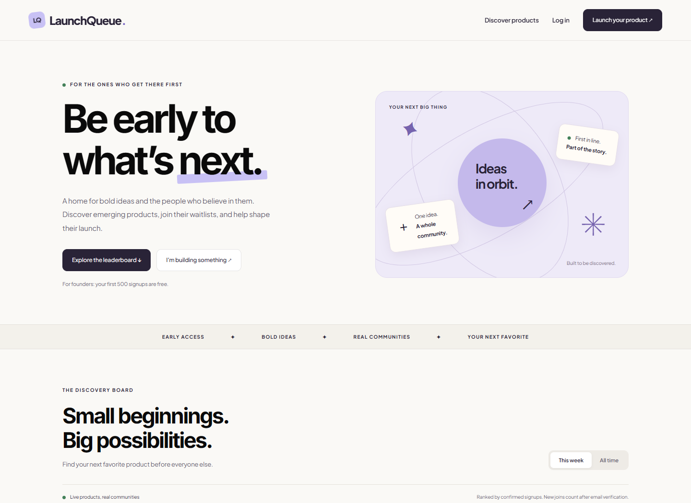
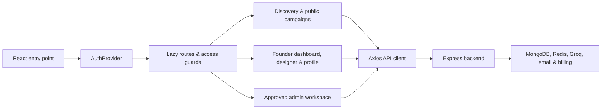

<div align="center">
  
  <h1>LaunchQueue</h1>
  <p><strong>Discover early. Launch your idea. Grow your community.</strong></p>
  <p>A React frontend for branded campaign pages, referral waitlists, and founder workspaces.</p>
  <p>
    <a href="https://launchqueue-omega.vercel.app/">Live application</a> ·
    <a href="https://github.com/codeWith-Ashwani/launchqueue-backend">Backend repository</a> ·
    <a href="#quick-start">Quick start</a>
  </p>
  <p>
    <a href="https://github.com/codeWith-Ashwani/launchqueue/actions/workflows/ci.yml"></a>
    <a href="https://react.dev"></a>
    <a href="https://vite.dev"></a>
    
    
  </p>
</div>

[](https://launchqueue-omega.vercel.app/)

LaunchQueue brings product discovery and prelaunch growth into one experience. Visitors find emerging products, join their waitlists, and share referral links. Founders design a branded page, follow signup activity, and manage their early community from a dedicated workspace.

This repository contains the frontend. The [Express backend](https://github.com/codeWith-Ashwani/launchqueue-backend) handles authentication, Groq generation, verification, ranking, billing, and admin authorization.

## Explore the project

- [Product experience](#product-experience)
- [Tech stack](#tech-stack)
- [Quick start](#quick-start)
- [Environment configuration](#environment-configuration)
- [Project structure](#project-structure)
- [Frontend architecture](#frontend-architecture)
- [Routes and access](#routes-and-access)
- [Rendering and accessibility](#rendering-and-accessibility)
- [Testing and CI](#testing-and-ci)
- [Deployment](#deployment)
- [Author](#author)

## Product experience

| Experience | What you can do |
| --- | --- |
| **Discover products** | Browse weekly and all-time rankings, explore campaign pages, and join early communities. |
| **Design a campaign** | Generate a Groq design draft from a product brief, preview it, and edit layout, typography, colors, images, copy, and section order. |
| **Grow a waitlist** | Verify an email, track a private queue position, share a referral link, and follow referral milestones. |
| **Manage a launch** | Review charts and subscribers, page through records, adjust queue positions, send invitations, and export CSV on paid plans. |
| **Manage your profile** | Update account details, review campaigns and subscription status, open billing, and change security settings. |
| **Control discovery** | List or unlist a campaign and pause or resume signups directly from the profile, with immediate feedback. |
| **Administer the platform** | Search founders and subscribers, explore campaigns, review platform totals, and moderate discovery listings with database-approved access. |

### Founder workflow

1. Sign in with email/password or Google.
2. Create a campaign and describe the product and preferred brand direction.
3. Generate a design draft or customize the page manually, then preview and publish.
4. Share the campaign and optionally list it on the discovery board.
5. Track verified signups, referrals, and invitations from the founder workspace.

Campaigns support centered, split, and editorial layouts, plus configurable features, story, steps, FAQ, and reward sections. AI drafts remain editable before publishing.

## Tech stack

| Layer | Technology | Purpose |
| --- | --- | --- |
| UI | React 19, CSS | Reusable components and responsive layouts |
| Build | Vite 8 | Development server and production bundling |
| Routing | React Router 7 | Public, founder, and admin navigation |
| Motion | GSAP, ScrollTrigger | Page and scroll transitions |
| API | Axios | Cookie-based requests to the backend |
| Charts | Recharts | Signup trends and conversion summaries |
| Unit/component tests | Vitest, Testing Library, jsdom | Interaction and state behavior |
| Browser tests | Playwright | Complete flows against an isolated real API |
| Hosting | Vercel | Frontend builds and deployment |

## Quick start

Use **Node.js 22** and npm. The steps below run the frontend with a seeded local backend.

### 1. Clone both repositories

Run these commands from the same parent directory:

```sh
git clone https://github.com/codeWith-Ashwani/launchqueue.git
git clone https://github.com/codeWith-Ashwani/launchqueue-backend.git
```

### 2. Start the demo API

In one terminal:

```sh
cd launchqueue-backend/server
npm ci
npm run demo
```

The API starts at `http://localhost:5051` with an ephemeral MongoDB replica set, 120 synthetic subscribers, and captured email.

### 3. Start the frontend

In a second terminal, starting from the parent directory:

```sh
cd launchqueue
npm ci
cp .env.example .env
```

On PowerShell, use `Copy-Item .env.example .env` to copy the template. Set this value in `.env`:

```env
VITE_API_URL=http://localhost:5051/api
```

Then start Vite:

```sh
npm run dev
```

Open [http://localhost:5173](http://localhost:5173).

### 4. Explore the seeded workspace

| Demo account | Email | Password |
| --- | --- | --- |
| Founder | `demo@example.com` | `DemoPassword123!` |
| Approved admin | `admin@example.com` | `DemoAdmin123!` |

Visit `/w/interview-demo` to try the public campaign. Captured verification and invitation emails are available at `http://localhost:5051/__demo/inbox`. These accounts and messages belong to the isolated demo.

For live Groq generation, real email, or billing integrations, start a configured backend with `npm run dev` using the [backend setup guide](https://github.com/codeWith-Ashwani/launchqueue-backend#local-development).

## Environment configuration

Use [`.env.example`](.env.example) as the frontend template. Restart Vite after editing environment values.

| Variable | Purpose |
| --- | --- |
| `VITE_API_URL` | Backend URL including `/api`; `http://localhost:5000/api` for the regular local API, or port `5051` for the demo |
| `VITE_GOOGLE_CLIENT_ID` | Optional public fallback Google OAuth web client ID |

Google sign-in normally loads its public client ID from `/api/auth/config`, configured through `GOOGLE_CLIENT_ID` on the backend. Groq, email, billing, and database credentials stay on the backend. The browser requests an AI draft through the authenticated API.

## Project structure

```text
src/
├── api/                 Axios client and request security
├── components/          Campaign designer, discovery, navigation, charts, and forms
├── context/             Authentication provider and shared session state
├── hooks/               Authentication, waitlist, and page-motion hooks
├── pages/               Public pages, founder workspace, profile, and admin
├── styles/              Platform, campaign, and designer styles
├── utils/               Campaign design helpers and Google SDK loader
├── test/                Test setup
├── App.jsx              Lazy routes and access guards
└── main.jsx             Application entry point
e2e/                     Playwright flows and isolated API startup
public/                  Public icons and favicon
.github/                 CI workflow and README preview
```

Unit and component tests live alongside their source folders in `__tests__` directories. Pages coordinate data and navigation; reusable components handle the UI, and hooks share session, waitlist, and motion behavior.

## Frontend architecture


```mermaid
flowchart LR
    ENTRY["React entry point"] --> AUTH["AuthProvider"]
    AUTH --> ROUTES["Lazy routes & access guards"]
    ROUTES --> PUBLIC["Discovery & public campaigns"]
    ROUTES --> FOUNDER["Founder dashboard, designer & profile"]
    ROUTES --> ADMIN["Approved admin workspace"]
    PUBLIC --> API["Axios API client"]
    FOUNDER --> API
    ADMIN --> API
    API --> BACKEND["Express backend"]
    BACKEND --> DATA["MongoDB, Redis, Groq, email & billing"]
```

The authentication provider restores the session through an HttpOnly cookie. Route guards guide navigation, while the backend enforces campaign ownership and admin approval on API requests. AI-generated designs are validated by the backend and displayed through the existing campaign components.

## Routes and access

| Route | Experience | Access |
| --- | --- | --- |
| `/` | Product discovery and landing page | Public |
| `/register`, `/login` | Founder signup and sign-in | Public |
| `/forgot-password`, `/reset-password` | Password recovery | Public |
| `/w/:slug`, `/w/:slug/welcome` | Campaign and welcome pages | Public; private subscriber status uses proof |
| `/dashboard` | Campaign overview | Founder |
| `/dashboard/new` | Campaign creation and design | Founder |
| `/dashboard/:id` | Analytics and subscriber controls | Campaign owner |
| `/dashboard/:id/settings` | Campaign branding and settings | Campaign owner |
| `/profile` | Account, campaigns, subscription, and security | Founder |
| `/pricing` | Plans and checkout | Founder |
| `/admin/login` | Admin sign-in | Public login entry |
| `/admin` | Platform administration | Database-approved admin |

### Admin approval

The footer's **Admin login** link opens the sign-in page or the workspace for an already signed-in administrator. Admin access requires `adminApproved: true` on the account's MongoDB record, assigned by a trusted database operator. Signup and profile forms cannot grant this approval. See the [backend admin setup](https://github.com/codeWith-Ashwani/launchqueue-backend#admin-access).

## Rendering and accessibility

- **Targeted campaign updates:** Toggles preserve the campaign list, update the selected row immediately, and restore its previous value if saving fails.
- **Continuous discovery:** Board refreshes keep existing results visible while loading the next response.
- **Route splitting:** Page modules load separately; analytics charts download with the campaign detail page.
- **Stable authentication:** Memoized context values and callbacks avoid unnecessary consumer updates, and development effects share the startup session request.
- **Immediate content:** GSAP uses short transform transitions without hiding text, avoids duplicate animation ownership, and respects reduced-motion preferences.
- **Lean read requests:** The browser security header is added to mutations, avoiding unnecessary preflight requests on reads.
- **Usable states:** Labeled controls, visible pending/error messages, responsive navigation, and unknown-route handling keep interactions understandable.

Subscriber proof arrives in URL fragments, is cleared from the address bar, and enables campaign-scoped status access. Referral storage is scoped to each campaign. Analytics use UTC dates and explicitly label the verified signup/visitor ratio.

## Testing and CI

The frontend suite contains **62 unit/component tests** and **12 browser flows**.

| Coverage | Examples |
| --- | --- |
| Public experience | Email verification, referrals, private status recovery, and product discovery |
| Founder workspace | Analytics paging, invitations, CSV export, profile edits, and campaign controls |
| Campaign design | Generated drafts, manual editing, publishing, and public branding |
| Access and rendering | Admin approval, Google button availability, failed saves, and slow-response rendering |

### Local checks

```sh
npm run lint
npm run contracts:check
npm run typecheck
npm test
npm run build
```

### Browser flows

Playwright starts its own frontend and demo API. Stop the manually started demo servers before running these flows. Backend dependencies must be installed.

For the repository layout from Quick start, run from the frontend directory:

```sh
export LAUNCHQUEUE_BACKEND_DIR="$(cd ../launchqueue-backend/server && pwd)"
npx playwright install chromium
npm run test:e2e
```

On PowerShell with installed Edge:

```powershell
$env:LAUNCHQUEUE_BACKEND_DIR = (Resolve-Path ../launchqueue-backend/server).Path
$env:PLAYWRIGHT_CHANNEL = "msedge"
npm run test:e2e
```

Tests use an isolated MongoDB replica set and captured email. The suite includes **64 unit/component tests** and **13 browser flows**, including persistent monitoring and mobile layout. GitHub Actions runs lint, API contract/type checks, tests, production builds, dependency audits, and browser flows against a pinned backend commit on `main`, `feature/**`, and pull requests to `main`.

### Generated API types

`contracts/openapi.yaml` is a snapshot of the backend's validated OpenAPI 3.1 interface. `npm run contracts:generate` refreshes that snapshot and `src/api/generated/schema.d.ts` from `LAUNCHQUEUE_BACKEND_DIR` (locally defaults to `../launchqueue/server`). `src/api/resources.ts` uses these types for analytics, discovery, founder overview, and monitoring requests; the rest of the application remains JavaScript. Compile-only regression checks reject unsupported query fields, invalid discovery periods, and private response fields.

When changing the API, regenerate the backend contract first, refresh frontend types, run `contracts:check` and `typecheck`, and update the CI backend fixture pin to the verified backend commit. CI rejects stale types and snapshots that differ from the pinned backend.

## Responsiveness measurements

Sampled page loads report **LCP** (loading), **INP** (interaction responsiveness), and **CLS** (layout stability) using a separately loaded Web Vitals module. Production defaults to sampling 10% of page loads; configure `VITE_PERFORMANCE_SAMPLE_RATE` between `0` (disabled) and `1` (every load). Reports contain only the metric name, value, and initial document route template. Campaign slugs, account IDs, query strings, tokens, and DOM entries are excluded.

Measurements describe the initial document, including subsequent SPA interactions. The reporter batches at most three metrics, flushes when the page hides or every 15 seconds when values are available, and drops failed delivery without blocking the UI. Database-approved admins can expand **Service health & traces** in `/admin` to inspect persisted observations, objective status, and sampled request operations. Collection uses the backend's existing MongoDB database with seven day expiry. The panel explains sample counts and approximate percentiles; its requests retain the same database approval checks as other admin routes. Browser tests exercise a real Web Vitals beacon and MongoDB trace export against the isolated API.

The [backend performance suite](https://github.com/codeWith-Ashwani/launchqueue-backend#performance-and-observability) adds concurrent analytics load tests and a CI latency/error gate for repeatable performance comparisons.

## Deployment

The frontend is deployed on [Vercel](https://launchqueue-omega.vercel.app/).

| Setting | Value |
| --- | --- |
| Framework | Vite |
| Build command | `npm run build` |
| Output directory | `dist` |
| API environment variable | `VITE_API_URL=https://launchqueue-backend.onrender.com/api` |

Configure the backend's `CLIENT_URL` to match the frontend origin. Google OAuth uses a web client ID with that origin registered. AI generation, email delivery, subscription billing, and admin approval are configured through the backend.

For a local production build preview:

```sh
npm run build
npm run preview
```

## Author

Built and maintained by **[codeWith-Ashwani](https://github.com/codeWith-Ashwani)**.

[Explore LaunchQueue](https://launchqueue-omega.vercel.app/) · [View the backend](https://github.com/codeWith-Ashwani/launchqueue-backend)
